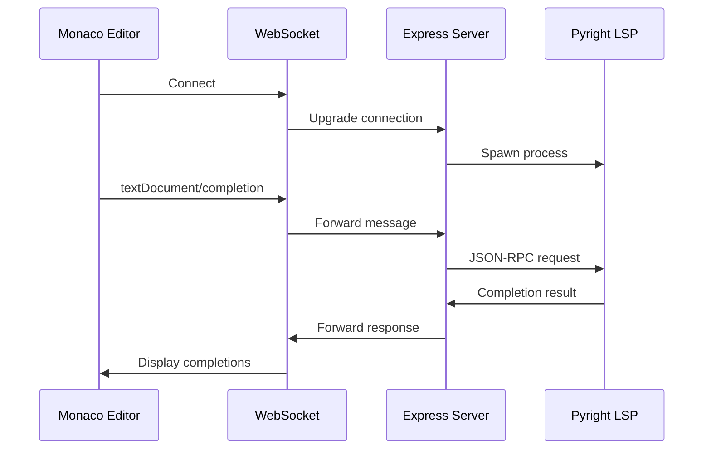

# Data Flow

<!-- BEGIN:REPO_WIKI_MANAGED -->

## Message Flow

### LSP Completion Request Flow

```
1. User types in editor
   ↓
2. Monaco triggers completion request
   ↓
3. WebSocket sends: textDocument/completion
   ↓
4. Express server receives message
   ↓
5. Server forwards to Pyright LSP
   ↓
6. Pyright analyzes code
   ↓
7. Pyright returns completion items
   ↓
8. Server forwards via WebSocket
   ↓
9. Monaco displays completion list
```

### LSP Diagnostics Flow

```
1. User types code
   ↓
2. Pyright analyzes in background
   ↓
3. Pyright sends diagnostics notification
   ↓
4. Server forwards via WebSocket
   ↓
5. Monaco displays error/warning markers
```

## Sequence Diagram



## State Management

**Editor State** (Browser):
- Document content
- Cursor position
- Completion items cache
- Diagnostics markers

**Connection State** (Server):
- Active WebSocket connections
- LSP process status
- Message queue

**LSP State** (Pyright):
- Workspace files
- Type information
- Analysis results

<!-- END:REPO_WIKI_MANAGED -->

## Team Notes

- 消息是异步的，使用 id 关联请求和响应
- LSP 支持增量同步，减少数据传输
