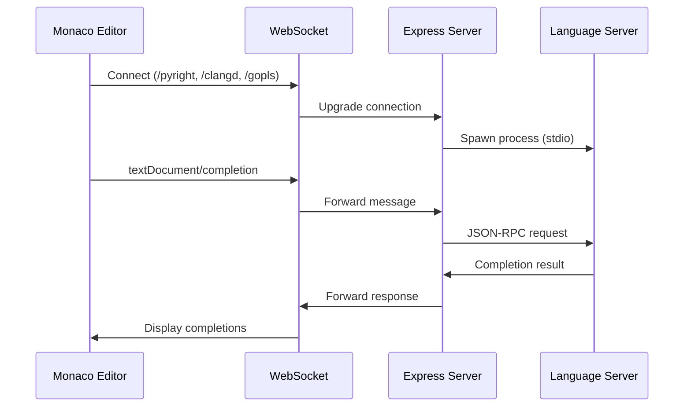
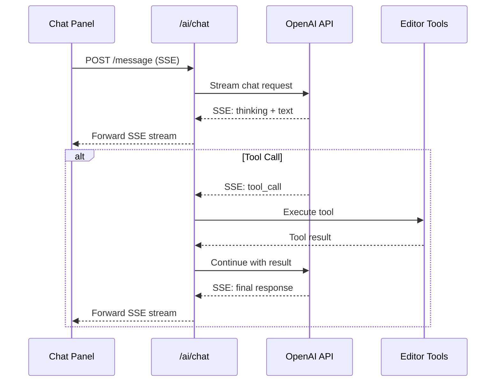

# Data Flow

<!-- BEGIN:REPO_WIKI_MANAGED -->

## Message Flow

### LSP Completion Request Flow

```
1. User types in editor
   ↓
2. Monaco triggers completion request
   ↓
3. WebSocket sends: textDocument/completion
   ↓
4. Express server receives message
   ↓
5. LSP Proxy forwards to language server (Pyright/clangd/gopls)
   ↓
6. Language server analyzes code
   ↓
7. Language server returns completion items
   ↓
8. Server forwards via WebSocket
   ↓
9. Monaco displays completion list
```

### LSP Diagnostics Flow

```
1. User types code
   ↓
2. Language server analyzes in background
   ↓
3. Language server sends diagnostics notification
   ↓
4. Server forwards via WebSocket
   ↓
5. Monaco displays error/warning markers
```

### AI Inline Completion Flow

```
1. User types in editor
   ↓
2. MonacoInlineCompletionsProvider triggers (debounced 500ms)
   ↓
3. GhostTextController builds prompt (prefix + suffix)
   ↓
4. HTTP POST /ai/completion (prefix, suffix, context, language, stream)
   ↓
5. Backend assembles FIM prompt based on config:
   - Manual FIM (qwen/deepseek/codellama/starcoder/codex): wrap in <|fim_prefix|>...<|fim_suffix|>...<|fim_middle|>
   - Native FIM: pass prefix + suffix directly via OpenAI suffix parameter
   ↓
6. Backend proxies assembled prompt to OpenAI API
   ↓
7. SSE stream returns completion text
   ↓
8. PostProcessor trims/reformats completion
   ↓
9. Monaco displays ghost text inline
```

### AI Chat Flow

```
1. User sends message in chat panel
   ↓
2. Chat Store assembles context (messages + context items)
   ↓
3. HTTP POST /ai/chat/message (SSE)
   ↓
4. Backend builds context block + tool definitions
   ↓
5. OpenAI API streams response (SSE)
   ↓
6. If tool_call: backend executes tool → returns result → continue
   ↓
7. Chat panel renders streaming response
```

### MCP Editor Control Flow

```
1. External MCP client sends request (stdio/SSE)
   ↓
2. editor-mcp-server dispatches tool call
   ↓
3. EditorCommandClient sends command via EditorControlHub
   ↓
4. Hub forwards to editor WebSocket connection
   ↓
5. Browser editor-mcp-client executes command (file operations)
   ↓
6. Response flows back through the chain
```

## Sequence Diagram





## State Management

**Editor State** (Browser):
- Document content (per-file Monaco model)
- Cursor position and view state
- Completion items cache (RadixTrie prefix cache)
- Ghost text state (currentGhostText)
- Diagnostics markers (per-language)
- Open files map (file-store)

**Chat State** (Browser):
- Messages array with fold state
- Context items (file/selection)
- Streaming state + abort controller
- API configs (completion + chat)
- Conversation history
- Skill/MCP registries

**Connection State** (Server):
- Active WebSocket connections (LSP + editor-control)
- LSP process status (per-language)
- EditorControlHub pending commands
- MCP client connections

**Config State** (Server → Disk):
- User settings (settings.json)
- API configs (completion-api-configs.json, chat-api-configs.json)
- Conversation history (conversation-history.json)
- MCP server configs (mcp-servers.json)

<!-- END:REPO_WIKI_MANAGED -->

## Team Notes

- 消息是异步的，使用 id 关联请求和响应
- LSP 支持增量同步，减少数据传输
- AI 聊天的工具调用循环支持多轮 tool_call → result → continue
- 内联补全使用防抖（500ms）和冷却期（2000ms）避免过度请求
